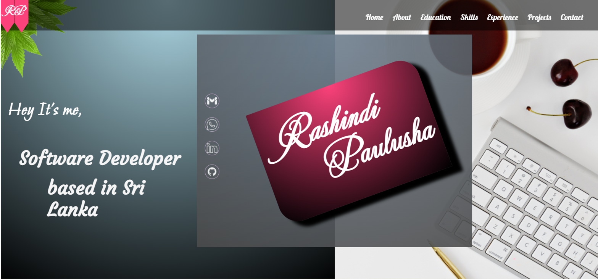
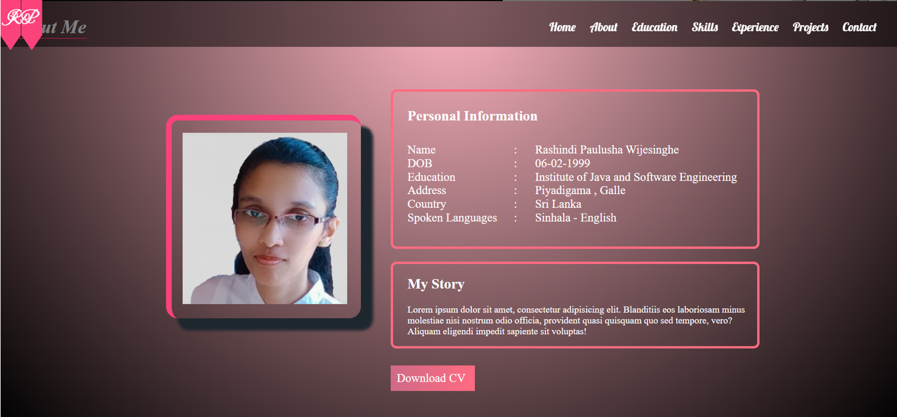
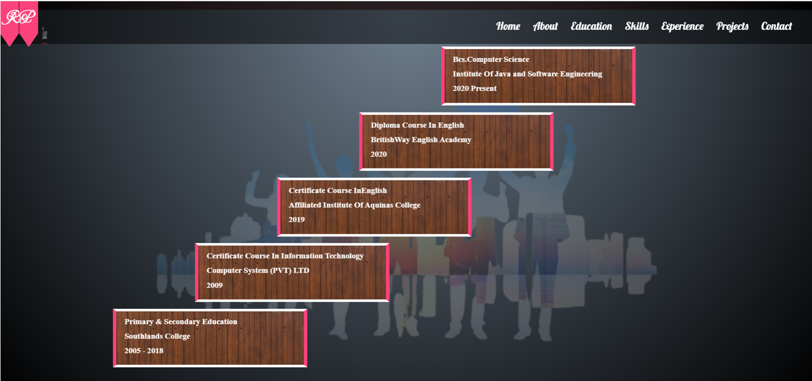
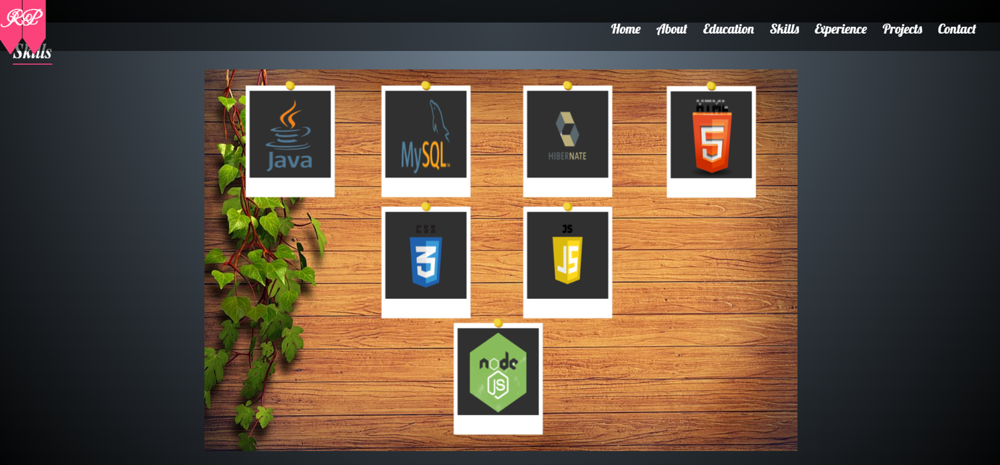
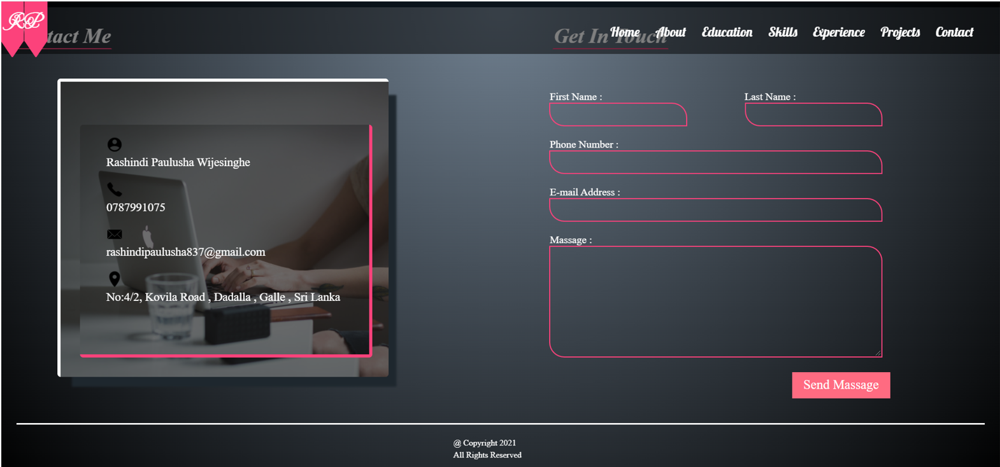
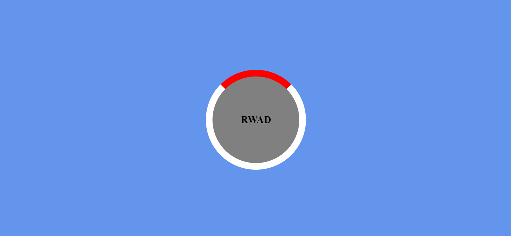
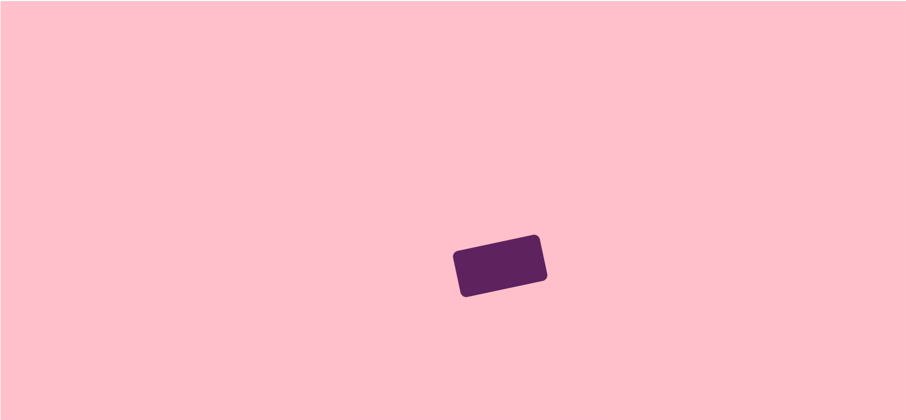
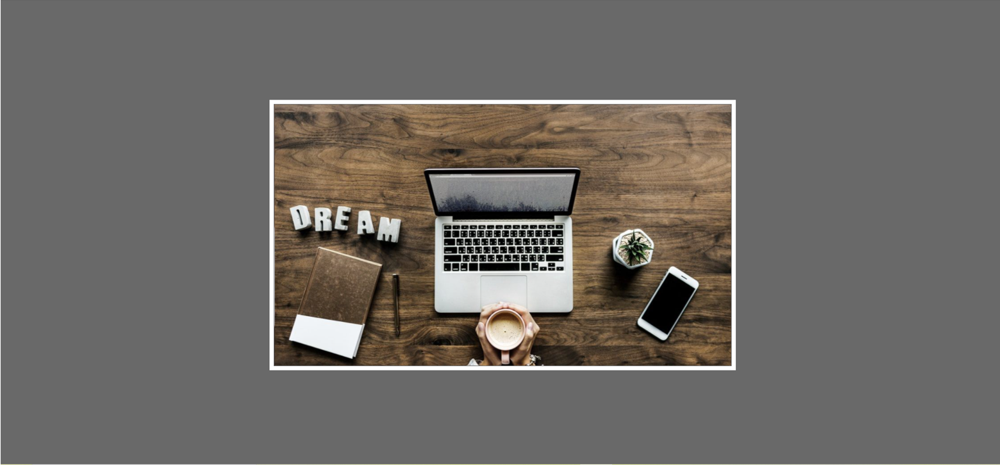
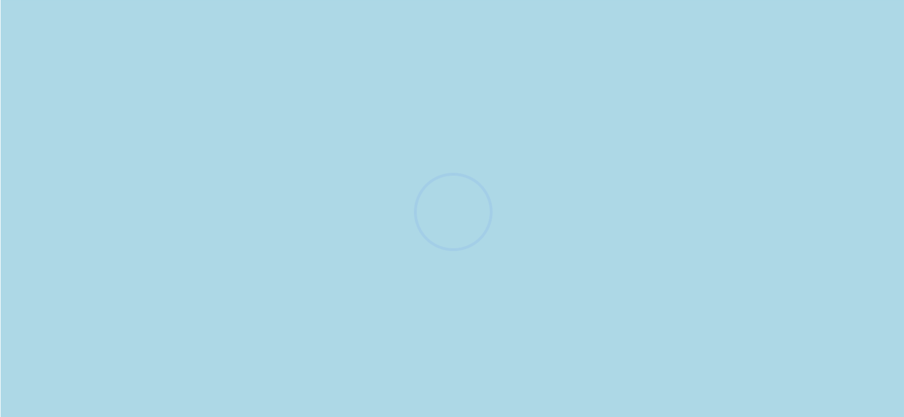

# *About* ❓

This is my **Personal Profile**.

I'm Rashindi Paulusha Wijesinghe and I am passionate software engineer based in Sri Lanka.
This is a professional documentation that provides proof of my accomplishments of my work.

# *Importance* 📝

This is a great way to demonstrate my competencies. During a job Search, this profile showcase my work to the potential employers.
It presents evidence of my relevant skills and abilities.

# *Details* 🔖

Below you can see the languages , tools I used and some links of my Profile.

## Images 📷

## Assignments 📋

1. ### Layout

    * Case 1- http://localhost:63342/MyProfile/myProjects/css/Layout/Case1/index.html
    

   
   * Case 2- http://localhost:63342/MyProfile/myProjects/css/Layout/Case2/index.html
   

   
   * Case 3- http://localhost:63342/MyProfile/myProjects/css/Layout/Case3/index.html
   

   * Case 4- http://localhost:63342/MyProfile/myProjects/css/Layout/Case4/index.html
    

    
2. ### Responsive

    * Case 1- http://localhost:63342/MyProfile/myProjects/css/Responsive/Case1/index.html
    

        
3. ### Transition

    * Case 1- http://localhost:63342/MyProfile/myProjects/css/Transition/Case1/index.html
    

   * Case 2- http://localhost:63342/MyProfile/myProjects/css/Transition/Case2/index.html
   

    
4. ### Animation

    * Case 1- http://localhost:63342/MyProfile/myProjects/css/Animation/Case1/index.html
    

   * Case 2- http://localhost:63342/MyProfile/myProjects/css/Animation/Case2/index.html
   

   * Case 3- http://localhost:63342/MyProfile/myProjects/css/Animation/Case3/index.html
   

   * Case 4- http://localhost:63342/MyProfile/myProjects/css/Animation/Case4/index.html
   
   

## Languages 📗

   

## Tools 📌

## Links 🔎

* **SiteMap URL-** https://www.gloomaps.com/Jc9afdjkC6

* **Wireframe URL-** https://wireframe.cc/1Wnk7i

* **Mockup URL-** https://www.figma.com/file/sC3QVYd1k8yUdJRAru7VsM/Untitled?node-id=15%3A50

* **Github Pages URL for MyProfile-** https://rashindipaulusha99.github.io/MyProfile/

* **000WebHost URL-** https://rashindipaulushawijesinghe.000webhostapp.com/

* **GitHub Link-** https://github.com/RashindiPaulusha99

